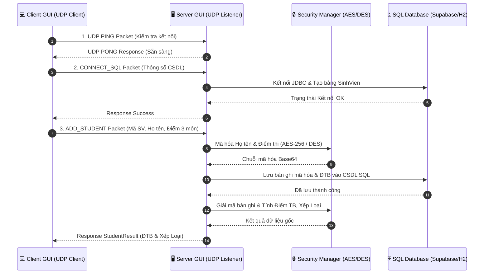

# 🎓 HỌC VIỆN CÔNG NGHỆ BƯU CHÍNH VIỄN THÔNG (PTIT)
## Đề Tài 12: Hệ Thống Quản Lý Sinh Viên Truyền Bảng Mạng UDP & Bảo Mật Mã Hóa CSDL SQL


Hệ thống ứng dụng quản lý sinh viên phân tán Client-Server viết bằng ngôn ngữ Java, truyền nhận gói tin thời gian thực qua giao thức **UDP (`DatagramSocket`)**, tích hợp cơ chế bảo mật mã hóa đối xứng **AES-256 / DES**, lưu trữ cơ sở dữ liệu đa nền tảng **SQL (Supabase Cloud PostgreSQL / H2 Embedded / SQL Server / MySQL)** và xuất báo cáo chuẩn **Excel (.xlsx)**.

---

## 🌟 1. Tính Năng Chi Tiết Phân Hệ

### 👨‍🎓 Phân Hệ Client (`ClientGUI.java`)
- **Giao diện chuẩn Enterprise PTIT**: Tone màu đỏ thương hiệu PTIT (`#C8102E`) kết hợp giao diện phẳng hiện đại **FlatLaf**.
- **Live Status Badges**: Hiển thị trạng thái kết nối thời gian thực (`UDP Server Status`, `SQL Database Status`).
- **Tự động kết nối (Auto-Connect)**: Tự động khởi tạo kết nối Server UDP và CSDL mặc định ngay khi bật app.
- **Quản lý Sinh viên (CRUD Workspace)**:
  - Form nhập liệu sinh viên: Họ tên, Mã SV, Điểm Toán, Điểm Văn, Điểm Tiếng Anh.
  - Tính toán tự động: Server tự động giải mã, tính **Điểm Trung Bình (ĐTB)** và xếp loại học lực (**Xuất sắc, Giỏi, Khá, Trung bình, Yếu**).
  - Tìm kiếm & Bộ lọc: Tra cứu sinh viên theo từ khóa (Mã SV, Họ tên) và lọc nhanh theo phân loại học lực.
  - Thao tác dữ liệu: Xóa bản ghi đã chọn, tải lại danh sách, làm mới form.
- **Xuất Báo Cáo Excel (.xlsx)**: Đóng gói và xuất danh sách sinh viên ra tệp Excel định dạng đẹp mắt.
- **Cấu hình Kết nối Linh hoạt (Settings Tab)**: Cho phép chuyển đổi linh hoạt IP/Port Server UDP và thông số kết nối CSDL SQL.

### 🛡️ Phân Hệ Server (`ServerGUI.java`)
- **Bảng Console Quản trị Server**: Kích hoạt / Dừng lắng nghe cổng UDP (Default `9876`), tùy chọn thuật toán mã hóa (**AES-256** hoặc **DES**).
- **Giám sát Mã hóa CSDL (Encrypted Data Inspection)**: Hiển thị bảng đối chiếu trực quan dữ liệu thô đã mã hóa trong CSDL (Base64 Ciphertext) và dữ liệu sau khi giải mã.
- **Biểu đồ Thống kê Học lực (PTIT JFreeChart)**: Trực quan hóa tỷ lệ phân bổ xếp loại học lực của toàn bộ sinh viên trong hệ thống.
- **Nhật ký Live UDP Traffic (Real-time Logs)**: Theo dõi từng gói tin UDP gửi/nhận giữa Client và Server theo thời gian thực (Ping, Connect SQL, Add Student, Search, Delete, Get All).

---

## 🏗️ 2. Kiến Trúc Hệ Thống & Luồng Dữ Liệu

### 📡 Sơ đồ Truyền Nhận Gói Tin UDP (Network Packet Flow)



### 📁 Cấu Trúc Thư Mục Mã Nguồn

```
LapTrinhMang-KetThucMon/
├── pom.xml                                  # Tệp cấu hình Maven & Dependencies
├── run.bat                                  # Script khởi chạy ứng dụng nhanh trên Windows
├── database.sql                             # File SQL khởi tạo CSDL & View thống kê
├── README.md                                # Tài liệu hướng dẫn dự án
└── src/
    ├── main/
    │   └── java/
    │       └── com/
    │           └── qlsv/
    │               ├── AppLauncher.java     # Trình khởi chạy hệ thống (Main Launcher)
    │               ├── model/
    │               │   ├── StudentData.java # Model dữ liệu sinh viên đầu vào
    │               │   ├── StudentResult.java# Model kết quả sinh viên (ĐTB, Xếp loại)
    │               │   └── SqlConfig.java   # Model cấu hình kết nối CSDL SQL
    │               ├── security/
    │               │   ├── SecurityManager.java # Trình quản lý thuật toán AES-256 / DES
    │               │   ├── AESEncryption.java   # Mã hóa & Giải mã AES-256 CBC
    │               │   └── DESEncryption.java   # Mã hóa & Giải mã DES ECB
    │               ├── database/
    │               │   └── DatabaseManager.java # Quản lý JDBC & Truy vấn CSDL SQL
    │               ├── network/
    │               │   ├── UDPPacket.java   # Cấu trúc gói tin dữ liệu truyền qua UDP
    │               │   └── PacketType.java  # Enum phân loại thao tác mạng UDP
    │               ├── util/
    │               │   └── ExcelExporter.java # Xuất báo cáo danh sách ra file Excel (.xlsx)
    │               ├── server/
    │               │   ├── UDPServer.java   # UDP Server Listener đa luồng (ThreadPool)
    │               │   └── ServerGUI.java   # Giao diện điều khiển & giám sát Server
    │               └── client/
    │                   ├── UDPClient.java   # Engine gửi/nhận UDP phía Client (Timeout 5s)
    │                   └── ClientGUI.java   # Giao diện người dùng Quản lý Sinh viên
    └── test/
        └── java/
            └── com/
                └── qlsv/
                    ├── security/
                    │   └── DESEncryptionTest.java # Unit Test mã hóa DES
                    ├── network/
                    │   ├── FullSystemIntegrationTest.java # Integration Test toàn hệ thống
                    │   └── SupabaseTest.java              # Test kết nối CSDL Cloud Supabase
                    └── GuiDemoAutomationRunner.java       # Script test tự động giao diện
```

---

## 🛠️ 3. Hướng Dẫn Dành Cho Thành Viên Nhóm (Clone & Development)

### 📌 Yêu Cầu Tiền Đề (Prerequisites)
- **JDK (Java Development Kit)**: Phiên bản **17** trở lên.
- **Apache Maven**: Phiên bản **3.8+** (Đã tích hợp sẵn trong IntelliJ IDEA / Eclipse).
- **Git**: Đã cài đặt trên máy.

---

### 📥 Bước 1: Clone Repository Về Máy Cá Nhân

Mở cửa sổ Terminal / PowerShell / Git Bash và chạy lệnh:

```bash
git clone https://github.com/phamcongthanhvn2k6/LapTrinhMang-KetThucMon.git
cd LapTrinhMang-KetThucMon
```

---

### ⚙️ Bước 2: Biên Dịch & Cài Đặt Thư Viện

Chạy lệnh Maven để tải dependencies và biên dịch mã nguồn:

```bash
mvn clean package -DskipTests
```

---

### 🚀 Bước 3: Khởi Chạy Ứng Dụng

#### Cách 1: Sử dụng File Khởi Chạy Nhanh (`run.bat`)
Chỉ cần nhấp kép vào tệp `run.bat` ở thư mục gốc dự án. Một cửa sổ Menu chọn sẽ xuất hiện:
1. **Khởi chạy CẢ HAI**: Bật đồng thời cả Server GUI và Client GUI trên màn hình.
2. **Khởi chạy SERVER GUI**: Dành cho máy đóng vai trò Server trên mạng LAN/Wi-Fi.
3. **Khởi chạy CLIENT GUI**: Dành cho các máy sinh viên / cán bộ nhập liệu.

#### Cách 2: Chạy Bằng Lệnh Maven
```bash
# Khởi chạy Menu Launcher chung
mvn exec:java -Dexec.mainClass="com.qlsv.AppLauncher"

# Khởi chạy riêng Server GUI
mvn exec:java -Dexec.mainClass="com.qlsv.server.ServerGUI"

# Khởi chạy riêng Client GUI
mvn exec:java -Dexec.mainClass="com.qlsv.client.ClientGUI"
```

---

### 🧪 Bước 4: Chạy Unit Test & Kiểm Thử Tích Hợp

Đảm bảo tất cả các chức năng mã hóa và truyền tin hoạt động chính xác trước khi code tính năng mới:

```bash
mvn test
```

---

## 🤝 4. Quy Trình Push Code & Merge Cho Thành Viên Nhóm

Để đảm bảo dự án không bị xung đột mã nguồn (merge conflicts) giữa các thành viên, vui lòng tuân thủ quy trình Git sau:

### 1️⃣ Tạo nhánh mới (Feature Branch) khi làm chức năng mới:
```bash
# Cập nhật mã nguồn mới nhất từ branch main
git checkout main
git pull origin main

# Tạo và chuyển sang branch làm việc cá nhân (VD: feature/export-pdf)
git checkout -b feature/ten-chuc-nang
```

### 2️⃣ Commit code với thông điệp rõ ràng:
```bash
git add .
git commit -m "feat: Thêm chức năng lọc sinh viên theo điểm trung bình"
```

### 3️⃣ Cập nhật nhánh cá nhân với `main` trước khi đẩy code:
```bash
git checkout main
git pull origin main
git checkout feature/ten-chuc-nang
git rebase main
```

### 4️⃣ Merge vào nhánh `main` và Push lên GitHub:
```bash
git checkout main
git merge feature/ten-chuc-nang
git push origin main
```

---

## 🏆 Đóng Góp Dự Án
- **Tác giả / Lead Developer**: Phạm Công Thành (phamcongthanhvn2k6)
- **Học viện**: Học viện Công nghệ Bưu chính Viễn thông (PTIT)
- **Môn học**: Lập Trình Mạng - Đề tài Kết thúc môn
